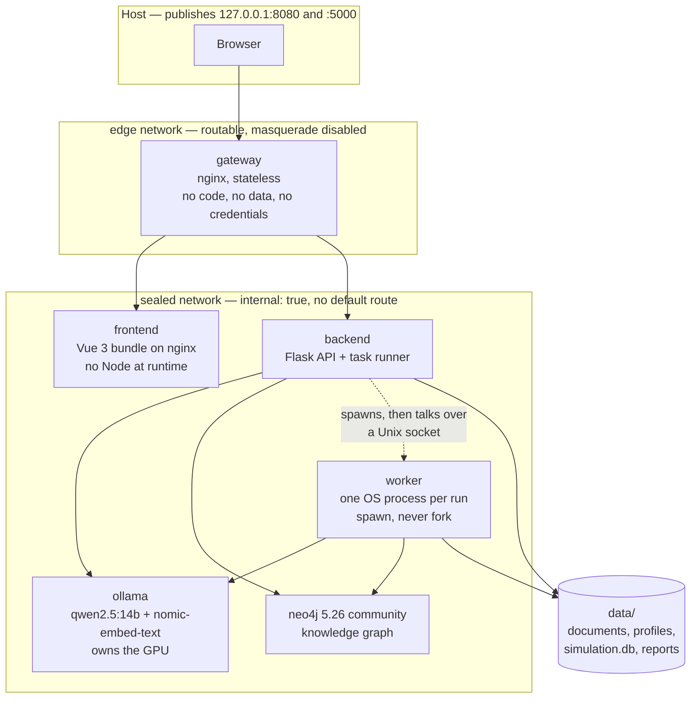

# Architecture

How the pieces fit together, and why several of them are shaped the way they are.

---

## Components



**The gateway is the only thing outside the seal**, and it is deliberately empty: no
application code, no credentials, no data. It exists because a container on an
`internal: true` network cannot be reached *from the host* either — reachability and
egress are the same property — so the alternative would be giving the backend a route
out. See [`PRIVACY.md`](PRIVACY.md).

**Ollama owns the GPU; nothing else does.** A worker is a Python process making HTTP
calls, and holds no VRAM at all. That is why holding a finished worker open for
interviews costs nothing on the card.

---

## Data flow

```mermaid
graph LR
    doc["Document<br/>txt, md, pdf"] --> chunk["Parse<br/>and chunk"]
    chunk --> onto["Ontology<br/>proposed"]
    onto -.->|"parks for<br/>review"| human(["Operator"])
    human -.->|approves| extract
    onto --> extract["Entity and<br/>relationship<br/>extraction"]
    extract --> graph[("Neo4j<br/>knowledge graph")]
    graph --> personas["Persona synthesis<br/>+ synthetic expansion"]
    personas --> scenario["Scenario<br/>event, seeds, schedule"]
    scenario --> run["OASIS simulation<br/>isolated process"]
    run --> db[("simulation.db<br/>per run")]
    db --> report["Grounded report"]
    db --> interview["Interviews"]
    report --> exports["Markdown / HTML"]
```

Two places deliberately stop and wait for a person: the **ontology**, because extraction
is the expensive stage and a wrong schema wastes all of it, and the **scenario**, because
it decides what the population is reacting to. Both park as `awaiting_review` — a task
state that is neither running nor finished, which is why the polling machine has four end
states rather than three.

---

## The five stages, and what each owns

| Stage | Produces | Backed by |
|---|---|---|
| 1. Graph build | A knowledge graph from one document | `/api/graph/*`, Neo4j |
| 2. Environment | A population of agents | `/api/simulation/prepare`, `profiles.json` |
| 3. Simulation | A completed run | `/api/simulation/start`, a worker process |
| 4. Report | A grounded, cited document | `/api/report/*` |
| 5. Interaction | Interviews with agents | `/api/simulation/interview*` |

The URLs are named after the resource rather than the stage number, because stages 1 and
2 happen before a simulation exists and a graph can feed several simulations.

---

## Decisions worth knowing before changing anything

### One OS process per run, spawned not forked

Each simulation runs in its own process, independently killable, checkpointed and
resumable. **`spawn`, never `fork`** — the parent holds an asyncio loop, Neo4j driver
connections and open SQLite handles, none of which survive a fork intact.

The consequence for anyone writing code that runs in the worker: `spawn` re-imports
`__main__`, so anything at module scope runs again in every child.

### The worker builds its own configuration

A worker calls `get_config()` inside its own process and reads the environment. The
manager's `Config` object does **not** reach it — only the concurrency share is passed as
an argument. Overriding a setting on the manager's config to change worker behaviour
silently does nothing.

### The inference budget is divided, not handed out

```
per_worker = (LLM_CONCURRENCY - API_LLM_RESERVE) // MAX_CONCURRENT_SIMULATIONS
```

Divided by the *maximum* number of concurrent runs rather than the current number, so a
worker's share never changes underneath it. Rebalancing live workers over IPC would buy
idle GPU at the cost of a failure mode where a lost message oversubscribes the card.

The reserve exists so the API can still serve interviews and queries while a run is in
flight — without it, a saturated GPU makes the UI look dead.

Measured: this costs less than the arithmetic suggests. One 14b generation already
saturates the card, so a lone run with `per_worker = 1` still sees ~83% GPU utilisation.

### Round boundaries are rowid high-water marks

OASIS writes to its own tables and has no concept of a round. The ledger records, per
round, the highest rowid in each table at the moment the round ended. Everything
round-scoped — "posts in round 3", rollback, resume — is derived from those marks.

A checkpoint is written **only after a round completes**, because a checkpoint for a round
that did not finish is a lie the resume then trusts.

The run database is put into **WAL** mode: two processes write it (the engine as agents
act, the ledger as rounds checkpoint), and SQLite's default rollback journal lets a writer
block everything for its whole transaction.

### Interviews need a live worker; history does not

An agent answers in character from memory held in the running process. When the worker
exits, the population becomes unreachable — but the interview *history* is written to the
run's database and outlives it.

A finished run therefore keeps its worker answering for a while
(`INTERVIEW_WINDOW_SECONDS`, default 120, measured from the last question rather than from
the end of the run). During that window the run's `state` is `complete` while
`interviewable` is true: they are different questions and the API reports both.

A lingering worker yields its concurrency slot the moment a real run needs it.

### Reports cite, and are verified before they are returned

The numbers come from SQL; the model writes prose about them. Every claim carries post
ids, agent ids and rounds, and grounding checks them against the run **before** the report
is returned: a claim citing evidence that does not exist is dropped and recorded, and a
claim citing nothing is kept and recorded. Those are different failures and conflating
them hides what matters.

The verification record is always published with the report, including when it is clean —
a document that quietly dropped three fabricated claims looks identical to one that never
made any.

### Provenance is immutable

Every agent records whether it stands for someone the document actually named or is a
plausible member of the crowd we invented. It cannot be edited, and neither can the link
back to the graph entity. Relabelling a synthetic agent as `named` would put invented
words in a real person's mouth in every report that followed, and nothing downstream could
tell.

---

## Storage

| What | Where | Rebuildable |
|---|---|---|
| Uploaded documents | `data/uploads/`, `data/graphs/` | No |
| Knowledge graph | Neo4j volume | Yes, from documents, at inference cost |
| Agent personas | `data/simulations/<id>/profiles/` | No — the model does not repeat itself |
| Simulation results | `data/simulations/<id>/simulation.db` | No |
| Reports | `data/reports/` | Yes, from a run that still exists |
| Task records | `data/tasks.db` | No |
| Model weights | Ollama volume | Yes, with a network |

The "no" column is what [`../scripts/backup.sh`](../scripts/backup.sh) exists for, and
why [`../scripts/cleanup.py`](../scripts/cleanup.py) refuses to delete a run a report
cites.

---

## Request paths

Everything the browser does is same-origin. The gateway serves the UI on `:8080` and
proxies `/api` underneath it, so there is no CORS in the project at all and no backend
host to configure.

```
Browser ──▶ :8080/           ──▶ gateway ──▶ frontend  (static bundle)
Browser ──▶ :8080/api/...    ──▶ gateway ──▶ backend
Tooling ──▶ :5000/api/...    ──▶ gateway ──▶ backend   (curl, tests)
```

Security headers are set by the backend *and* re-set at the gateway behind
`proxy_hide_header`, so exactly one of each reaches the browser — two different CSPs are
enforced as their intersection, which is a confusing way to break a page.

---

## Further reading

| Document | Contents |
|---|---|
| [`PRIVACY.md`](PRIVACY.md) | The allowlist, how the seal is enforced, how to verify it |
| [`PROVISIONING.md`](PROVISIONING.md) | The one-time pull, and re-sealing afterwards |
| [`performance-baseline.json`](performance-baseline.json) | Measured timings and the hardware |
| [`../REQ_SPEC.md`](../REQ_SPEC.md) | The full specification, with an account of every step |
